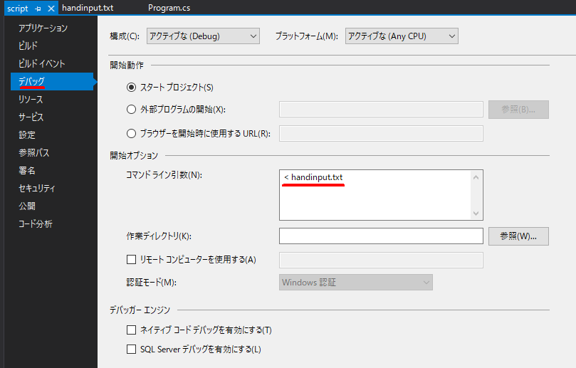

# 概要  
競技プログラミング(AtCoder等)の実行環境です。  
下記言語に対応しています。  
- Python  
- C#(試行中)  

# ファイル構成
## 共通
- handinput.txt  
問題ごとの入力例を転記し、プログラム(script.py等)で利用するためのファイル。  

- strategy.md  
コーディング中の気づきや実装方針をメモ書きするためのファイル。  

## Pythonの場合
- py/script.py  
問題を解くためのコードを記述し実行するためのファイル。  

- py/sandbox.ipynb  
部分的に試したいコードを実行するためのファイル。  

- py/utils.py  
標準入力をファイルの内容に置き換える処理など課題を解くためのコードとは直接関係しないユーティリティ関数の置き場所。

## C#の場合
- csharp/script/script/Program.cs  
問題を解くためのコードを記述し実行するためのファイル。  

※プロジェクト設定の[デバッグ]-[コマンドライン引数]に下記の記述が必要です。
これによりhandinput.txtの入力内容をプログラムで利用できるようになります。  

